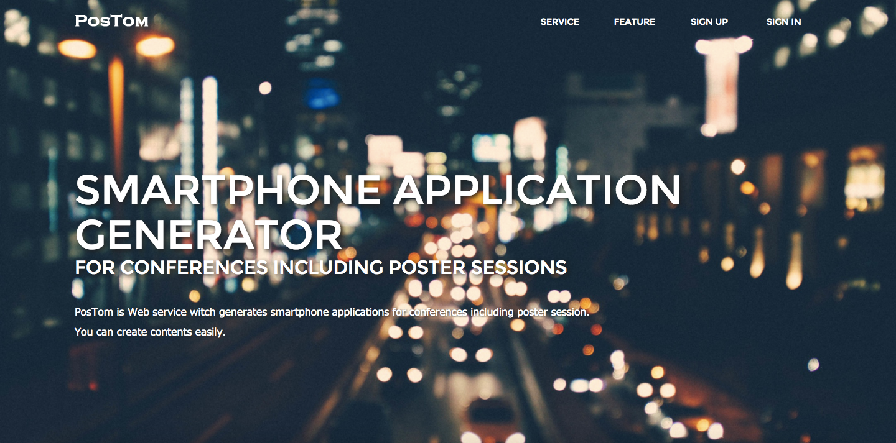
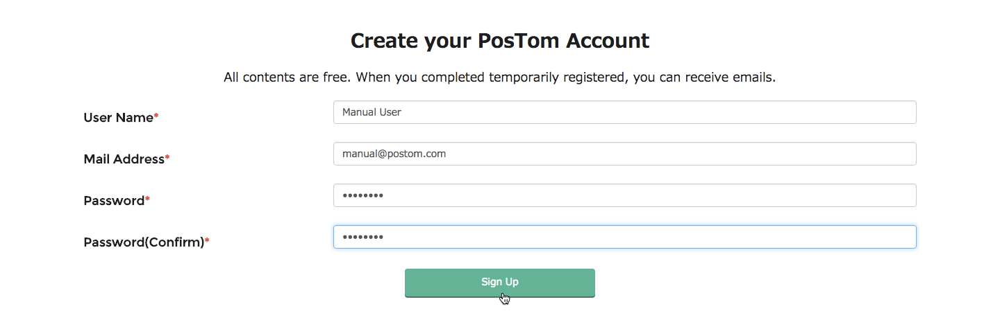
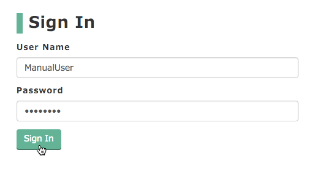
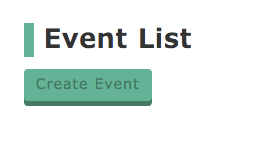
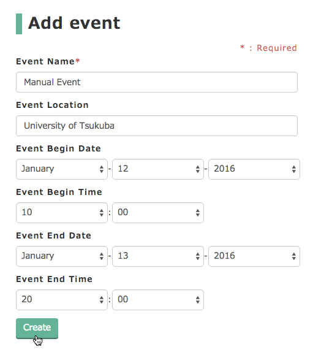
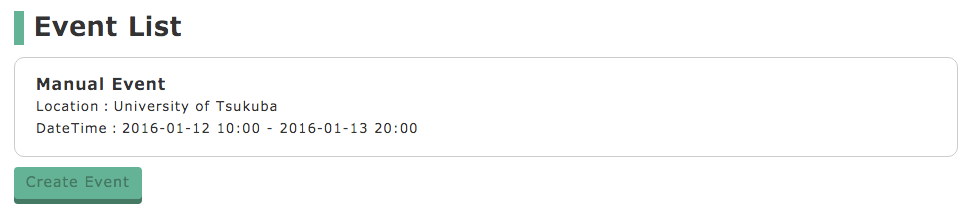
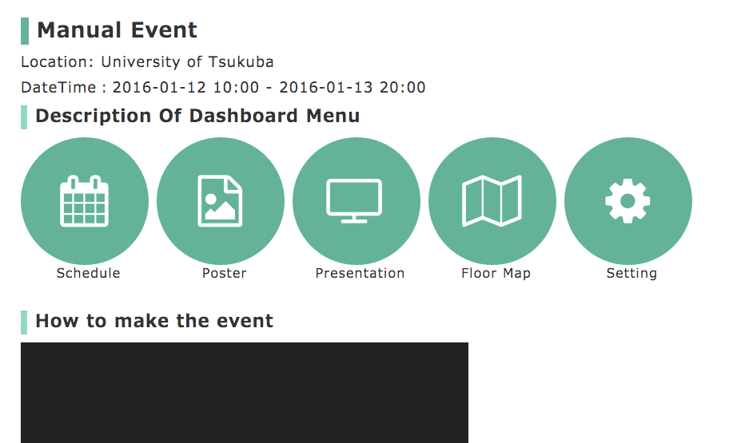
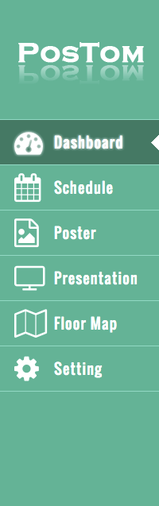
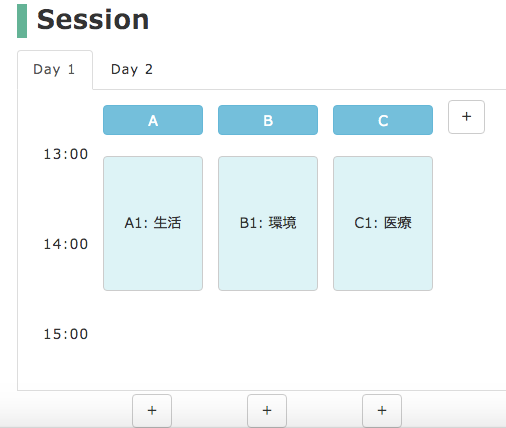
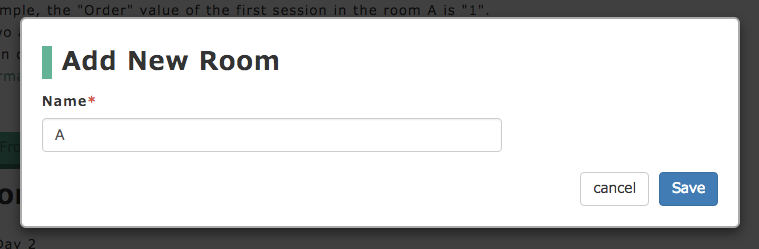

# PosTom
　PosTomは、展示会向けwebアプリ作成支援ツールです。
ポスター発表を含む学会を対象とし、ポスター配置をwebブラウザ上で配置することができます。




## 概要
　展示会などを含む学会のためのスマートフォン向けWebアプリ「PosMApp」はDEIM2015をはじめとする様々な学会で利用されたきました。
　実際の利用を経て、多くの方々から「他の学会で利用したい」との要望があったが、現在のPosMAppを他の学会で利用しようとする際には、コード変更などの専門的な作業が必須でした。
　そこで、我々はPosMAppを各イベントごとに簡単に作成できるようなWebアプリ「PosTom」を開発しました。
　PosTomを利用することにより、ポスターセッション・タイムテーブル・プレゼンテーション一覧のコンテンツを簡単に作成することができ、CSVファイルの一括登録やドラッグアンドドロップによる直感的な操作により、学会向けWebアプリ作成の労力を大幅に削減が可能となりました。
　

## システム要件
PosTomはCakePHP 2.xを使用して開発されております。
そのためシステム要件には[CakePHP 2.x のシステム要件](http://book.cakephp.org/2.0/ja/installation.html#id2)に準拠することが求められます

* HTTP サーバー (Apache推奨)
* PHP 5.3.0 以上
* MySQL 4 以上


## 動作環境
以下のブラウザ・バージョンで動作できることを確認しております。

* Google Chrome 40 以上
* Firefox 40 以上
* Safari 9 以上


## サービスの設置方法
ここでは、githubリポジトリの取得からサービス開始までの手順を説明します。

### Step.1 GitHubからソースを取得
```
wget --no-check-certificate https://github.com/tsss-a/PosTom/archive/master.zip
```

### Step.2 ファイルを解凍
```
unzip master.zip
```

### Step.3 プロジェクトフォルダの権限を設定
```
chmod -R 755 プロジェクト名
```

### Step.4 .gitignoreされているtmpフォルダを生成
```
cd プロジェクト名/app/
mkdir tmp
```

### Step.5 .gitignoreされているtmpフォルダの権限を設定
```
chmod -R 755 tmp
```

### Step.6 .gitignoreされているtmpファルダ内のemptyファイルを個別生成
```
cd tmp && mkdir cache && mkdir logs && mkdir sessions && mkdir tests && cd cache && mkdir models && mkdir persistent && mkdir views && touch models/empty && touch persistent/empty && touch views/empty && cd ../ && touch logs/empty && touch sessions/empty && touch tests/empty
```

### Step.7 databaseファイルの複製
```
cd ../Config/
cp database.php.default database.php
```

### Step.8 databaseファイルの編集
```
class DATABASE_CONFIG {
	public $default = array(
		'datasource' => 'Database/Mysql',
		'persistent' => false,
		'host' => '[データベースホスト名]',
		'login' => '[ユーザー名]',
		'password' => '[パスワード]',
		'database' => '[データベース名]',
		'prefix' => '',
		'encoding' => 'utf8',
	);
	public $test = array(
		'datasource' => 'Database/Mysql',
		'persistent' => false,
		'host' => '[データベースホスト名]',
		'login' => '[ユーザー名]',
		'password' => '[パスワード]',
		'database' => '[データベース名]',
		'prefix' => '',
		'encoding' => 'utf8',
	);
}
```

以上で、ファイルやフォルダ構成の準備が整いました。

次に、データベースの設定をおこないます。

## データベース準備
ここでは、データベースにサービスで必要なテーブルの追加をおこないます。

まずは、SSHでサービスを設置したサーバに接続し、MySQLを起動し、使用するデータベースを選択したところから以下を初めてください。

### リポジトリに含まれているinit.sqlファイルを実行
SQLファイルまでのパスは各自で入力してください。

```
mysql > SOURCE /xxxxxxxxxxxx/init.sql
```

### テーブルが挿入されたことを確認
```
mysql > show tables;
```

以下のように表示されればデータベースの準備が完了です。

```
+------------------------------+
| name_of_database             |
+------------------------------+
| areas                        |
| authors                      |
| commentators                 |
| disuses                      |
| editors                      |
| events                       |
| posters                      |
| presentations                |
| rooms                        |
| schedules                    |
| test                         |
| users                        |
+------------------------------+
12 rows in set (0.00 sec)
```

## 使用マニュアル
ここでは一通り、学会用スマートフォン向けWebアプリ「PosMApp」を生成するための手順を説明します。

−−−−−−−−−−− 只今、ガイド用動画作成中 −−−−−−−−−−−

PosMAppを生成するには以下の手順をおこないます。

1. アカウント作成
2. ログイン
3. イベント作成
4. スケジュール
5. プレゼンテーション
6. ポスター
7. フロアマップ
8. セッティング
9. PosMAppで確認

以降、この手順に従って説明していきます

### 1. アカウント作成
アカウントをつくらなければ何も始まりません。

ランディングページ下部のアカウント作成フォームを入力し「**Sign Up**」ボタンを押します。

すべて必須項目となります



アカウント作成が完了すると、ページが遷移し以下のようなメッセージが表示されます

> Email was sent.  
Registration is not yet complete.  
Please check your email, and please finish registration.

フォームに入力したメールアドレス宛に**本登録用アドレス**を記載したメールを送ったことを示しています。

メールを受け取り、本文に記載されている**本登録用アドレス**にアクセスします。

以下のようなメッセージが表示されれば、本登録完了です。

> Registration was completed


### 2. ログイン
さっそくログインしてみましょう。

ランディングページの上部、または本登録完了ページの上部から「**Sign In**」を押してログインページに遷移します。



ページ上部に

> Welcome to PosTom [ユーザー名] !!

と表示されればログイン成功です。


### 3. イベント作成
さっそくイベントを作成していきましょう。

アカウント登録直後は何もイベントが作成されていないため、以下のように表示されていると思います。



イベントを生成していくと、こちらにイベントリストとして表示されていきます。

ここに表示されている「**Create Event**」ボタンを押すことでイベントを生成することができます。

「**Create Event**」ボタンを押すと、イベント作成ページに遷移します。

各項目を入力していきます。上からイベント名, イベント開催場所, イベント開始日時, イベント終了日時



※イベント開催日数は10日間以内です

イベントの作成が完了すると、イベントリストにさきほど作成したイベントが表示されます。



イベントを押すと、イベントのトップページ（以降、ダッシュボードページ）に遷移します。

以下のページが、ダッシュボードページになります。



イベントを押すと、サイドバーを利用することが可能になります。

以下の状態が、サイドバーが利用できる状態です。



ダッシュボードページでは、以下のような操作がおこなえます。

* 各サイドバーにおける説明閲覧
* PosMApp作成ガイド動画の視聴
* PosMAppでの動作確認

### 4. スケジュール
イベントの作成が完了したら、イベントのスケジュールを編集しましょう。

サイドバーの「**Schedule**」を押します。

スケジュールとはタイムテーブルのようなものです。

イベント作成直後は、何もスケジュールには登録されていません。

スケジュールを登録する方法は、

1. CSVファイルによる一括登録
2. 個別入力登録

の2つの方法があります。

スケジュールを登録する前に、セッションという概念について理解する必要があります。

詳しくは、辞書を参照ください。

タイムテーブルは複数のセッションで構成され、1つのセッションは複数のプレゼンテーションから構成されます。

簡単にいうと、同じカテゴリに分類できるプレゼンテーションをひとまとまりにしたものをセッションと理解しておいてください。

セッションはある部屋である時間帯でおこなわれるものです。これから登録していくものは、このセッションにあたります。

#### 1. CSVファイルによる一括登録
「**Add Session From CSV File**」ボタンを押し、あらかじめ用意しておいたCSVファイルを選択します。

ファイルを選択すると、自動的にファイルがアップロードされ、登録するセッションの一覧を確認できます。

確認してエラーがなく適切なものであると確認できたら「**Import**」ボタンを押して、登録を実行します。

登録が完了すると、以下のようにタイムテーブルの形式で表示されます。



#### 2. 個別入力登録
画面上の「**+**」ボタンを押し、ルームを追加します。



ルーム名を入力して「**Save**」ボタンを押す


ーーーーーーーーーーー 編集中 ーーーーーーーーーー


### 5. プレゼンテーション


### 6. ポスター


### 7. フロアマップ


### 8. セッティング


### 9. PosMAppで確認


## 問い合わせ
以上、マニュアルとなります。その他、問い合わせ等ありましたら開発者までお問合せください。


## 開発チーム
筑波大学 大学院 システム情報工学研究科 コンピュータサイエンス専攻  
高度IT人材育成のための実践的ソフトウェア開発専修プログラム（高度ITコース）

University of Tsukuba  
Graduate School of Systems and Information Engineering  
Department of Computer Science  
Practical Software Development Specialization Program  
for Advanced IT Personnel Training (AIT, SIT)

[小串 光和(Mitsukazu Ogushi)](https://github.com/tsss-g)  
[小幡 潤(Jun Obata)](https://github.com/tsss-j)  
[小寺 暁久(Akihisa Kodera)](https://github.com/tsss-a)  
[杜 天行(Du Tianhang)](https://github.com/tsss-t)


=======

Copyright &copy; [筑波大学CS専攻 高度ITコース](http://www.cs.tsukuba.ac.jp/ITsoft/)

Team TSSS

